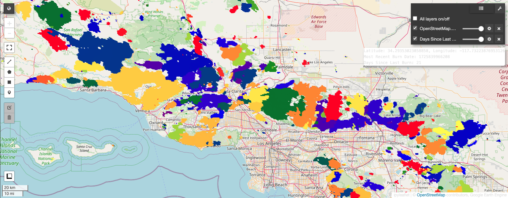

# Time Since Fire
Author: Pavan Appanna

---

## Requirements

Ensure the following software and dependencies are installed:

- **Python**: Version 3.10
- **Pip**: Python package manager
- **Git**: Version control system
- **Google Earth Engine Account**: Required to access data directly and avoid downloading the entire MODIS dataset

---

## Running the Code

### 1. Setup the virtual environment and install the required dependencies

```sh
cd TimeSinceFire
python3 -m venv fire #create a python virtual environment
source fire/bin/activate
pip3 install -r requirements.txt
```

### 2. Create a project on Google Earth Engine

1. Create a project on Google Earth Engine
2. Obtain the project ID

### 3. Run the code

Two methods are available, but only one is necessary. Execute the one that best suits your preferences or needs

#### 3.1. Method 1 (Preferred) - Run the Jupyter Notebook

This method generates an interactive map that shows the latitude, longitude, date of the last fire in epoch format (most recent burn date), and the number of days since the last fire occurred (Days Since Last Burn).

```sh
Jupyter Notebook
#<open method1_sce_timesincefire.ipynb>
```
You will be prompted to authenticate with your Earth Engine Account. Please complete this step.

In the last cell of the Jupyter Notebook, make the necessary changes:
```
initialize_ee - Add your Google Earth Engine project ID here.
start_date - Set the start date for the analysis
end_date - Set the end date for the analysis
southern_california - Specify the bounds for Southern California or any rectangular bounding box
center - Set the coordinates to focus the map on
palette - Choose the colors to use for visualization on the map
```

---

#### 3.2. Method 2 - Run the Python script

This code functions similarly to the one in the Jupyter Notebook, but it does not allow interaction with the map. The output is stored as a southern_california_burn_map.html file, which can be opened in any browser by double-clicking. 

```sh

python3 method2_sce_timesincefire.py

```

___

## Sample output


